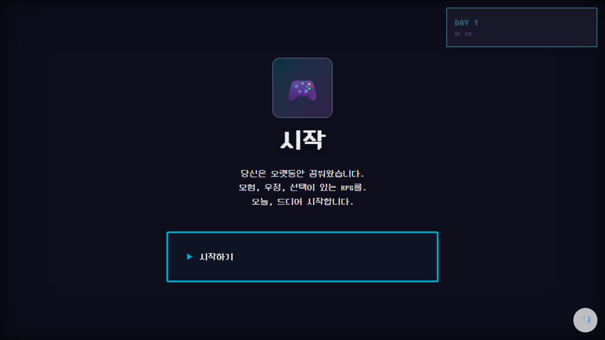
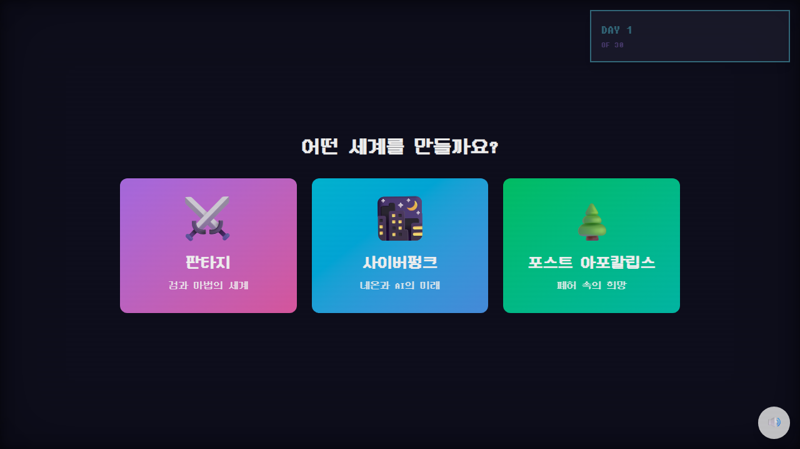

# 게임 개발 여정

30일 안에 RPG를 완성하는 게임 개발 시뮬레이터.

**[플레이하기](https://game-dev-journey.vercel.app/)**

## 컨셉

인디 게임 개발자가 되어 30일 안에 RPG를 출시한다. 완벽주의와 타협 사이에서 매일 선택을 내리고, 그 선택이 게임의 품질과 진행도뿐 아니라 **플레이 중인 이 게임의 인터페이스 자체**를 변화시킨다.

## 핵심 메카닉: 시각적 퇴화

타협을 많이 할수록 게임 UI가 실제로 망가진다.

- 배경이 흐려지고 채도가 빠진다
- 텍스트가 시적인 문장에서 건조한 한 줄로 줄어든다
- 레이아웃이 깔끔한 카드에서 깨진 레트로 스타일로 바뀐다

"내가 만드는 게임에 대한 선택이 내가 플레이하는 게임을 바꾼다"는 메타 피드백 루프.

## 구조

**1막: 꿈 (Day 1-5)** — 세계관 선택(판타지/사이버펑크/포스트 아포칼립스), 첫 코드, 첫 버그. 화면이 화려하고 활기참.

**2막: 현실 (Day 6-20)** — 반복 작업, 스코프 크립, 피로. 친구의 피드백, 오픈월드 vs 리니어 같은 결정. UI가 단순해지기 시작.

**3막: 타협 (Day 21-30)** — QA, 크리티컬 버그, 폴리싱, 최종 빌드. 출시할 것인가 미룰 것인가. UI가 최소한으로 퇴화.

## 엔딩

| 엔딩 | 조건 |
|------|------|
| 기적적 완성 | 높은 품질 + 높은 진행도 + 타협 최소 |
| 완벽주의의 끝 | 품질에만 집착, 진행도 부족 |
| 중도 포기 | Day 11에서 포기 선택 |
| 타협의 출시 | 기본 — 원래 기획과 실제 결과물의 비교가 나온다 |
